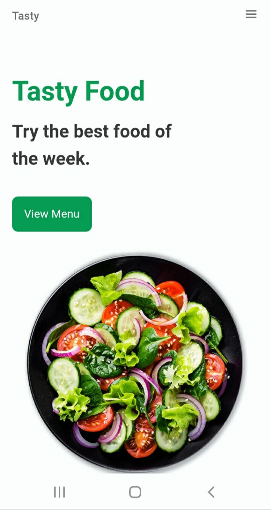
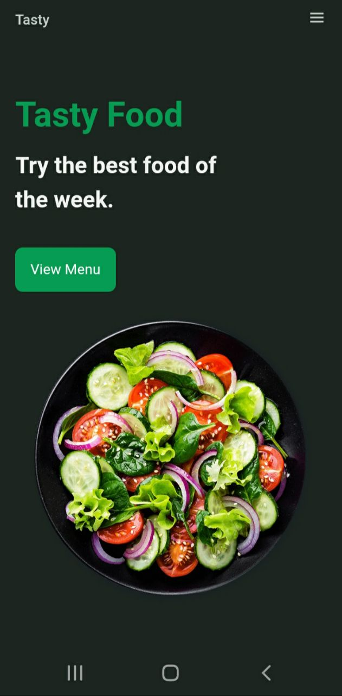
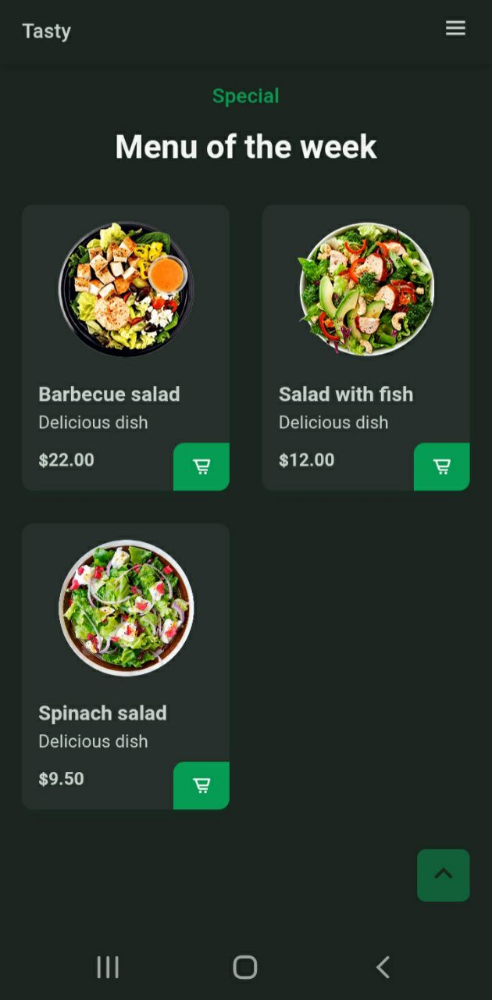

# Responsive-Food-Website
 Responsive website design with Javascript-HTML-CSS
 


=======
# 🍔 Responsive Food Website

A modern, mobile-friendly restaurant website built with vanilla HTML, CSS, and JavaScript.

🌐 **Live Demo**: [https://tasty-food-web.netlify.app](https://687d0757dadc5528a19bef32--tasty-food-web.netlify.app)

## 📸 Screenshots

| Desktop View | Mobile View |
|--------------|-------------|
|  |  | ![Mobile Screenshot] () () ()

## 🚀 About This Project

This is a responsive food ordering website featuring:

✔ Clean, modern UI design  
✔ Fully responsive layout (mobile, tablet, desktop)  
✔ Interactive elements with JavaScript  
✔ Smooth CSS animations and transitions  

### 🛠️ Built With
- **HTML5** (Semantic markup)
- **CSS3** (Flexbox, Grid, animations)
- **JavaScript** (DOM manipulation)

## ✨ Key Features
- Responsive navigation menu
- Food category filtering
- Dynamic content loading
- Optimized performance

## 📦 Installation
1. Clone the repository:
   ```bash
   git clone https://github.com/ellay21/Tasty-Responsive-Food-Website.git
